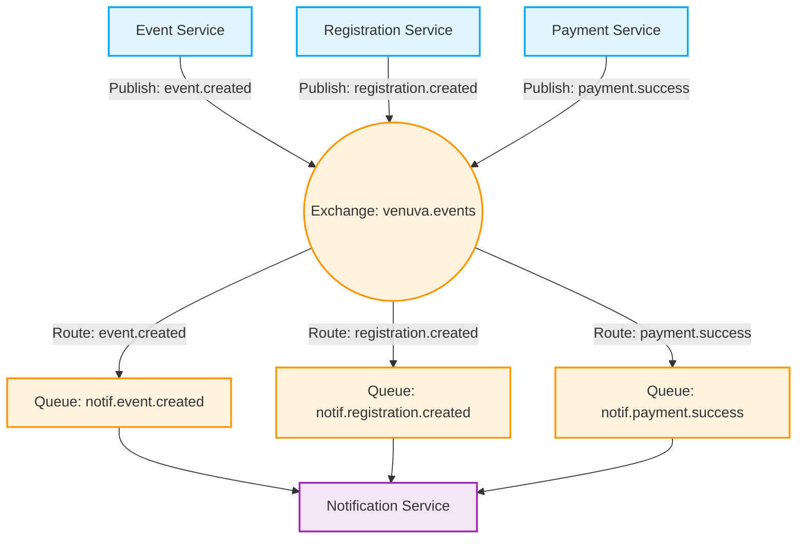
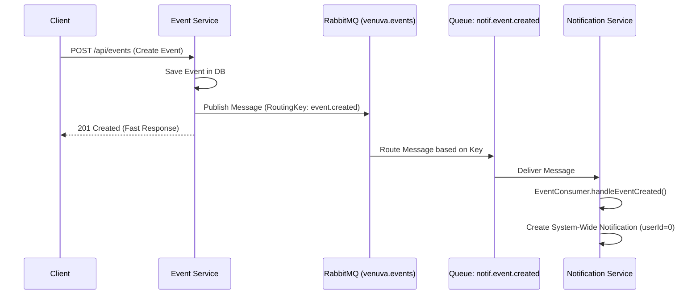
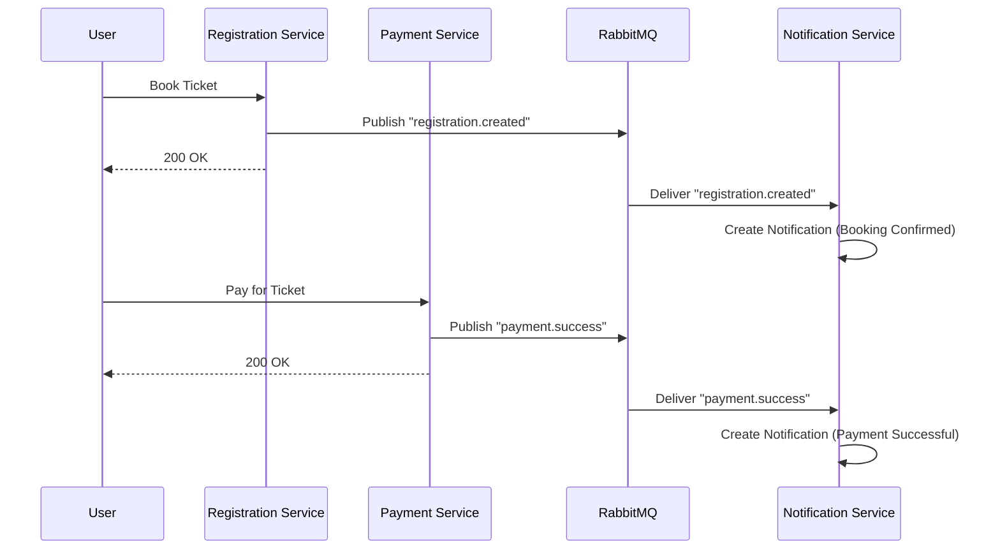

# تواصل الـ Microservices باستخدام RabbitMQ في مشروع Venuva

## 1. ما هو RabbitMQ ومتى يتم استخدامه؟
**RabbitMQ** هو Message Broker (وسيط رسائل) مفتوح المصدر يعتمد على بروتوكول AMQP. وظيفته الأساسية هي استلام الرسائل من تطبيق (المرسل أو Publisher) وتوصيلها لتطبيق آخر أو أكثر (المستقبل أو Consumer) بطريقة آمنة ومضمونة.

**متى نستخدمه؟ ولماذا هو موجود في مشروعك؟**
- **فك الارتباط (Decoupling):** في مشروعك، إذا تم إنشاء Event جديد في `event-service`، لا يجب أن يتصل مباشرة بـ `notif-service` لإرسال إشعار. إذا كانت خدمة الإشعارات متوقفة، لن يتعطل إنشاء الحدث، بل سيتم حفظ الرسالة في RabbitMQ حتى تعود خدمة الإشعارات للعمل.
- **التواصل غير المتزامن (Asynchronous Communication):** لكي لا يضطر المستخدم للانتظار. بمجرد إنشاء الفعالية أو إتمام الدفع، يتم إرجاع استجابة سريعة (200 OK) للمستخدم، وتتم معالجة الإشعارات في الخلفية.
- **تعدد المستمعين (Fan-out/Topic):** يمكن لرسالة واحدة (مثلاً `event.created`) أن تُقرأ بواسطة عدة خدمات في المستقبل دون تعديل كود الـ `event-service`.

---

## 2. كيف تتواصل الـ Microservices في Venuva؟

في مشروعك، يتم استخدام **التواصل غير المتزامن (Event-Driven)** عن طريق RabbitMQ.
الخدمات تتواصل عبر موزع (Exchange) مركزي يسمى `venuva.events`.

### المكونات الأساسية في الكود الخاص بك:
1. **Exchange (`venuva.events`):** هو الموزع الرئيسي. يستلم الرسالة من الـ Publisher ويقرر إلى أي طابور (Queue) يرسلها بناءً على مفتاح التوجيه. نوعه في مشروعك `TopicExchange`.
2. **Routing Key:** مفتاح التوجيه (مثل `event.created` أو `payment.success`).
3. **Queues:** الطوابير الخاصة بكل خدمة (مثل `notif.event.created`). كل خدمة تقوم بإنشاء الطوابير التي تحتاج أن تستمع إليها.

---

## 3. رسوم توضيحية (Diagrams) للتواصل في مشروعك

### أ. الهيكل العام للـ Architecture (Architecture Overview)

المخطط التالي يوضح كيف أن كل الخدمات ترسل أحداثها إلى الـ Exchange، والذي بدوره يقوم بتوزيعها إلى طوابير خدمة الإشعارات.



### ب. دورة حياة رسالة (Event Created) بالتفصيل

هذا المخطط يوضح ماذا يحدث بالضبط خلف الكواليس عند إنشاء حدث جديد:



**شرح الـ Flow (حسب الكود الفعلي في `EventConsumer.java` و `EventPublisher.java`):**
1. يقوم الـ **Event Service** بإنشاء الفعالية وحفظها.
2. يتم استدعاء `EventPublisher.publishEventCreated` لإرسال الرسالة إلى الـ Exchange `venuva.events` مع الـ Routing Key `event.created`.
3. يقوم الـ RabbitMQ بتوجيه الرسالة إلى الـ Queue المُسمى `notif.event.created`.
4. يستمع الـ **Notification Service** (عبر `EventConsumer`) لهذا الـ Queue باستخدام `@RabbitListener`.
5. يقوم بحفظ إشعار عام (Broadcast marker حيث `userId = 0`) للفعالية الجديدة ليراها الجميع.

### ج. دورة حياة الحجز والدفع (Registration & Payment)



---

## 4. تحليل كود RabbitMQ من مشروعك

### 1. إعدادات RabbitMQ (`RabbitMQConfig.java`):
يوجد في كل خدمة ملف Config لتعريف الـ Exchange. 
في خدمة الإشعارات (`notif-service`)، يتم إنشاء الطوابير وربطها بالموزع:
```java
public static final String EVENT_CREATED_QUEUE = "notif.event.created";
public static final String EXCHANGE = "venuva.events";

@Bean
public Binding eventCreatedBinding(Queue eventCreatedQueue, TopicExchange venuvExchange) {
    // اربط هذا الطابور بالموزع، وأعطني أي رسالة تحمل ختم "event.created"
    return BindingBuilder.bind(eventCreatedQueue).to(venuvExchange).with("event.created");
}
```

### 2. إرسال الرسائل (Publisher):
في `EventPublisher.java` داخل `event-service`:
```java
rabbitTemplate.convertAndSend(EXCHANGE, EVENT_CREATED_ROUTING_KEY, event);
```
يقوم الـ Event Service بإرسال الرسالة للموزع وينسى أمرها. لا يعلم بوجود خدمة إشعارات من الأساس، وهذا هو جوهر الـ **Decoupling**.

### 3. استلام الرسائل (Consumer):
في `EventConsumer.java` داخل `notif-service`:
```java
@RabbitListener(queues = RabbitMQConfig.EVENT_CREATED_QUEUE)
public void handleEventCreated(EventCreatedMessage message) {
    log.info("[RabbitMQ] EventConsumer.handleEventCreated() — eventId={}, title={}", ...);
    // ... إنشاء إشعار جديد في قاعدة البيانات ...
    notifService.createNotification(dto);
}
```
الـ Notification Service يستمع بشكل مستمر. بمجرد وصول رسالة إلى الطابور، يستيقظ هذا الـ Method ويقوم بإنشاء الإشعار الخاص بالمستخدم.

---
## الخلاصة
التواصل في مشروع Venuva مبني بشكل احترافي على هيكلية **Event-Driven Architecture**. 
الـ RabbitMQ يعمل كـ "مركز بريد" مركزي، يضمن أن كل خدمة (مثل تسجيل الدخول، الدفع، الفعاليات) تقوم بعملها بسرعة، وترمي "حدثاً" في البريد، لتلتقطه خدمات أخرى (مثل خدمة الإشعارات) وتقوم بمعالجته في وقتها دون إبطاء تجربة المستخدم النهائي.
