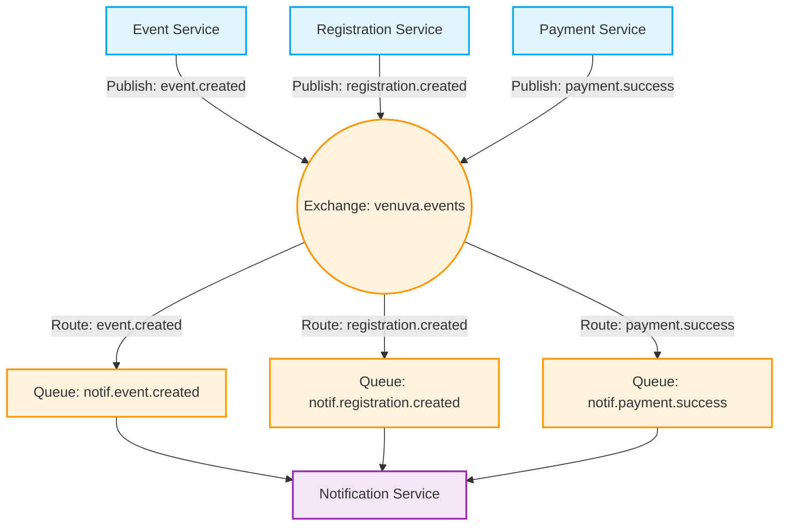
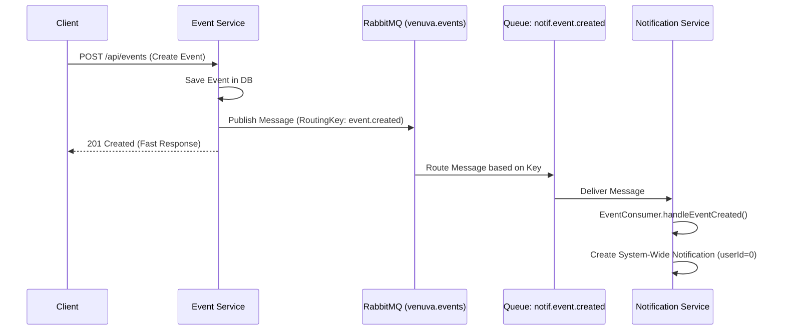
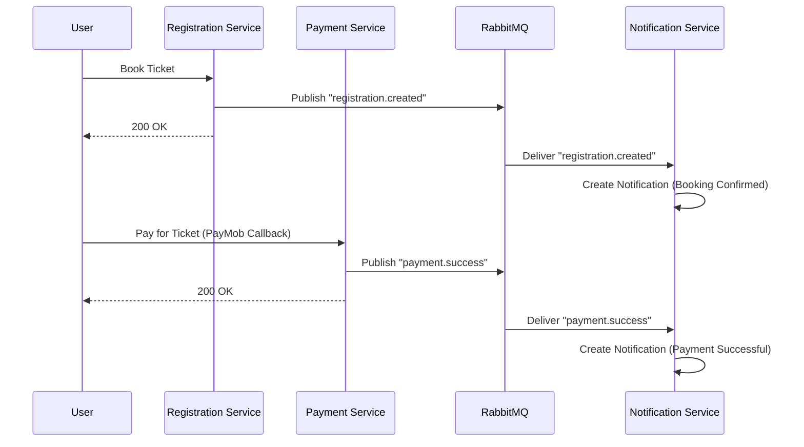

# Microservices Communication using RabbitMQ in Venuva

## 1. What is RabbitMQ and when to use it?
**RabbitMQ** is an open-source Message Broker that implements the AMQP protocol. Its primary job is to accept messages from an application (Publisher) and deliver them to one or more applications (Consumer) reliably and safely.

**When do we use it? And why is it in your project?**
- **Decoupling:** In your project, when a new Event is created in `event-service`, it doesn't need to synchronously call `notif-service` to send a notification. If the notification service is down, the event creation won't fail; instead, the message is safely stored in RabbitMQ until the notification service is back up.
- **Asynchronous Communication:** So the user doesn't have to wait. Once an event is created or a payment is complete, a fast response (200 OK) is returned to the user, and notifications are processed in the background.
- **Fan-out/Topic (Multiple Listeners):** A single message (e.g., `event.created`) can be consumed by multiple future services without requiring any code changes in the `event-service`.

---

## 2. How do Microservices communicate in Venuva?

In your project, **Asynchronous (Event-Driven) Communication** is implemented via RabbitMQ.
The microservices communicate through a central Exchange named `venuva.events`.

### Core Components in Your Code:
1. **Exchange (`venuva.events`):** The central router. It receives messages from publishers and decides which Queue to route them to based on a Routing Key. In your project, it's defined as a `TopicExchange`.
2. **Routing Key:** The message's address or label (e.g., `event.created` or `payment.success`).
3. **Queues:** The individual queues belonging to each service (e.g., `notif.event.created`). Each consumer creates its own queues to listen to the events it cares about.

---

## 3. Architecture & Flow Diagrams

### A. Architecture Overview

This diagram illustrates how all services publish their events to the central Exchange, which then routes them to the Notification Service's queues.



### B. Message Lifecycle Detailed Flow (Event Created)

This sequence diagram explains exactly what happens behind the scenes when a new event is created:



**Flow Explanation (Based on `EventConsumer.java` & `EventPublisher.java`):**
1. The **Event Service** creates and saves the event in the database.
2. `EventPublisher.publishEventCreated` is invoked, sending the message to the `venuva.events` exchange with the `event.created` routing key.
3. RabbitMQ routes the message to the specific queue named `notif.event.created`.
4. The **Notification Service** (via `EventConsumer`) listens to this queue using the `@RabbitListener` annotation.
5. It then creates a broadcast notification (marked by `userId = 0`) so all users can see the new event.

### C. Booking & Payment Lifecycle



---

## 4. RabbitMQ Code Analysis in Your Project

### 1. RabbitMQ Configuration (`RabbitMQConfig.java`):
Each service has a config file defining the Exchange. 
In the `notif-service`, queues are created and bound to the central exchange:
```java
public static final String EVENT_CREATED_QUEUE = "notif.event.created";
public static final String EXCHANGE = "venuva.events";

@Bean
public Binding eventCreatedBinding(Queue eventCreatedQueue, TopicExchange venuvExchange) {
    // Bind this queue to the exchange, and grab any message with the "event.created" routing key
    return BindingBuilder.bind(eventCreatedQueue).to(venuvExchange).with("event.created");
}
```

### 2. Publishing Messages (Publisher):
In `EventPublisher.java` (inside `event-service`) or `PaymentPublisher.java` (inside `paymentservice`):
```java
// Example from PaymentService after PayMob callback
paymentPublisher.publishPaymentSuccess(event);

// Inside the publisher:
rabbitTemplate.convertAndSend(EXCHANGE, PAYMENT_SUCCESS_ROUTING_KEY, event);
```
The Service sends the message to the Exchange and immediately returns. It doesn't know or care if the Notification Service is currently running—this is the core of **Decoupling**.

### 3. Consuming Messages (Consumer):
In `EventConsumer.java` or `PaymentConsumer.java` (inside `notif-service`):
```java
@RabbitListener(queues = RabbitMQConfig.EVENT_CREATED_QUEUE)
public void handleEventCreated(EventCreatedMessage message) {
    log.info("[RabbitMQ] EventConsumer.handleEventCreated() — eventId={}, title={}", ...);
    // ... Save new notification to the Database ...
    notifService.createNotification(dto);
}
```
The Notification Service constantly listens. The moment a message hits the queue, this method triggers and the notification logic executes.

---
## Conclusion
Communication in Venuva is professionally structured around an **Event-Driven Architecture**. 
RabbitMQ acts as the central "post office", ensuring that each service (Registration, Payment, Events) does its job quickly and simply drops an "event" in the mail. Other services (like Notifications) pick up those events and process them asynchronously, ensuring a highly responsive and decoupled end-user experience.
